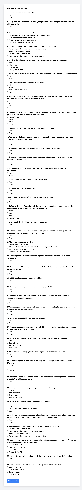

# 3305-midterm: A Quiz Question Parser

This project includes a Python script that parses quiz questions and answers from a PDF file and converts them into a structured JSON format.

## Features

- Extracts quiz questions and answers from PDF documents.
- Outputs the quiz data in a JSON format for easy use in web applications or databases.
- Customizable for different PDF structures and formats.

## Installation

Before running the script, ensure you have Python installed on your system. Then, install the required libraries using pip:

```bash
pip install PyMuPDF
```
Usage
To use the script, follow these steps:

Place your PDF file in the project directory.
Update the pdf_path variable in the script to match the name of your PDF file.
Run the script:
```bash
python quiz.py
```
The script will output the quiz questions and answers in JSON format.

## Screenshot


## Contributing
Contributions to improve the script or extend its capabilities are welcome. Please feel free to submit a pull request or open an issue.

## License
This project is licensed under the MIT License - see the LICENSE file for details.